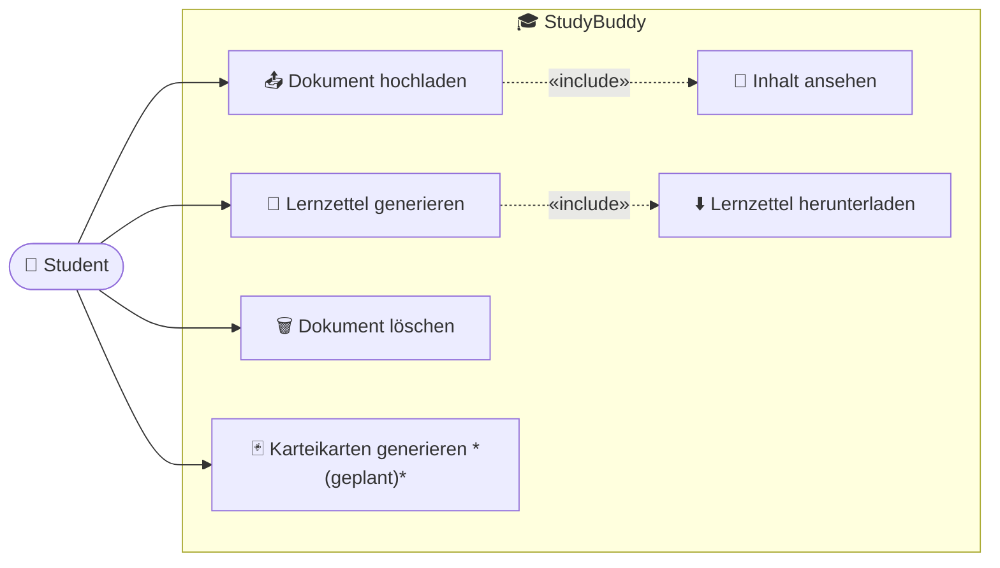

# Use Case Diagramm – StudyBuddy

```mermaid
graph LR
    Student(["👤 Student"])

    subgraph StudyBuddy["🎓 StudyBuddy"]
        UC1["📤 Dokument hochladen"]
        UC2["📄 Inhalt ansehen"]
        UC3["📝 Lernzettel generieren"]
        UC4["⬇️ Lernzettel herunterladen"]
        UC5["🗑️ Dokument löschen"]
        UC6["🃏 Karteikarten generieren *(geplant)*"]
    end

    Student --> UC1
    Student --> UC3
    Student --> UC5
    Student --> UC6

    UC1 -. "«include»" .-> UC2
    UC3 -. "«include»" .-> UC4
```

> Die PlantUML-Quelldatei befindet sich in [`use_case_diagram.puml`](./use_case_diagram.puml).
